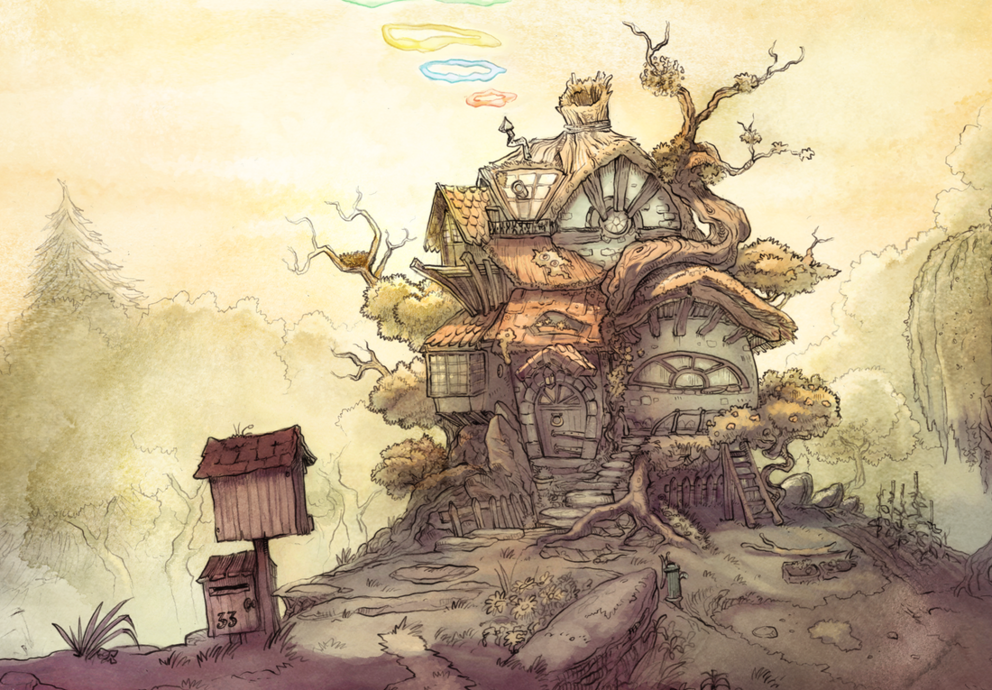

# Pepper&Carrot
# episode 02 : Rainbow Potion
http://www.peppercarrot.com

License
=======

##Artworks : 
[Creative Commons Attribution 3.0](https://creativecommons.org/licenses/by/3.0/)
Attribution to : "David Revoy, www.peppercarrot.com"

##Translators and correctors : 
*French : David Revoy
*English : David Revoy

##Fonts:
New fonts added in this project must be compatible with the CC-By license.
Are accepted : Public domain fonts, GNU/GPL fonts, CC-0 fonts, CC-BY fonts, SIL Open Font License (OFL) ,  + Name of author + Link
Not accepted : Font only known to be 'free' but without details or license, Copyrighted fonts, etc...
Good place for open fonts : [http://openfontlibrary.org](http://openfontlibrary.org)

##Font in use :
*Lavi.ttf
[GNU GPL V3](http://www.gnu.org/copyleft/gpl.html)
By Ruben Holthuijsen ( aka Rholt ), [reference](http://www.dafont.com/lavi.font)
